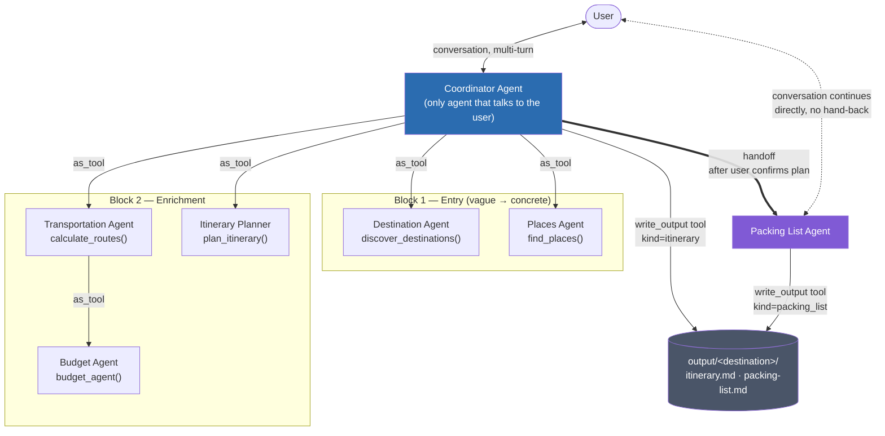
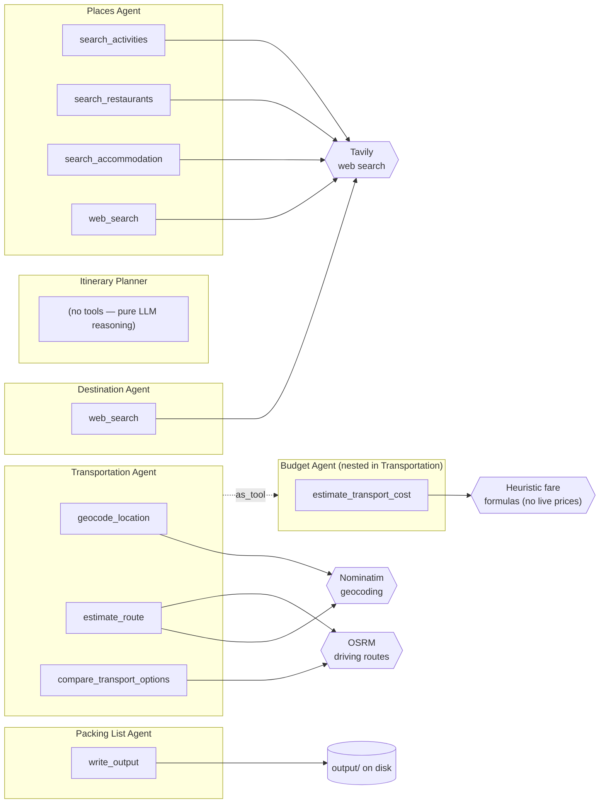

# Architecture

This document describes the agent architecture of the travel planning assistant: which
agents exist, what each one is responsible for, how they communicate, and why two
different SDK communication patterns (`as_tool()` and `handoffs=[...]`) are used side
by side. See the root [README.md](../README.md) for setup and usage.

## Diagram

Solid thin arrows (`as_tool`) are nested tool calls that always return to the caller.
The double arrow (`handoff`) is the one place control is permanently transferred.

### Internal tools and data sources

The diagram above is the Coordinator's view — it only sees the wrapper tool names. The
diagram below zooms in on what each specialist actually runs internally (the tools the
Coordinator never sees) and which external services back them.

## Agents

| Agent | File | Input → Output | Talks to user? |
|---|---|---|---|
| **Coordinator** | [`agents/coordinator.py`](../src/travelagent/agents/coordinator.py) | User message (+ conversation history) → routes to specialists, synthesizes final response | Yes — the only one, until it hands off |
| **Destination** | [`agents/destination.py`](../src/travelagent/agents/destination.py) | Vague constraints (region, activity, style) → ranked `DestinationList` | No |
| **Places** | [`agents/places.py`](../src/travelagent/agents/places.py) | Destination + preferences → `PlacesPool` (activities, restaurants, accommodation) | No |
| **Transportation** | [`agents/transportation.py`](../src/travelagent/agents/transportation.py) | Places pool → route legs, area clusters, sequencing/transfer constraints (`TransportationAgentOutput`) | No |
| **Budget** | [`agents/budget.py`](../src/travelagent/agents/budget.py) | Mode/distance/duration → cost estimate with assumptions | No |
| **Itinerary Planner** | [`agents/itinerary.py`](../src/travelagent/agents/itinerary.py) | Places pool + transportation guidance + duration → day-by-day `Itinerary` | No |
| **Packing List** | [`agents/packing.py`](../src/travelagent/agents/packing.py) | Confirmed itinerary (read from conversation history) → packing list markdown | Yes — after handoff, until the conversation ends |

## Pipeline flow

1. **Entry.** The Coordinator reads the user's brief. A vague request (e.g. "coastal
   hiking in Europe") goes through `discover_destinations()`; a concrete one (e.g.
   "Lisbon") skips straight to `find_places()`. The Coordinator always stops and waits
   for a user reaction after presenting destinations or places — these are conversational
   checkpoints, not tool calls.
2. **Enrichment.** Once the user has reacted to the places, the Coordinator calls
   `calculate_routes()` (Transportation Agent, which internally calls the Budget Agent
   as its own tool) and then `plan_itinerary()` (Itinerary Planner), passing the full
   structured transportation guidance through so scheduling respects area clusters,
   transfer buffers, and long-transfer warnings.
3. **Confirmation loop.** The Coordinator presents the day-by-day plan and stops again.
   If the user asks for changes, `plan_itinerary()` is called again with the requested
   changes (reusing the existing transportation guidance unless the places pool itself
   changed) — this repeats until the user explicitly confirms the plan is final.
4. **Persisting the itinerary.** Only once confirmed, the Coordinator calls the
   `write_output` tool with `kind="itinerary"` to save the final markdown to
   `output/<destination>/itinerary.md`.
5. **Handoff to packing.** The Coordinator hands off to the Packing List Agent. The
   Packing List Agent reads the destination and itinerary straight out of the
   conversation history (a handoff carries the full history, so no separate structured
   input is needed), builds a categorized packing list, calls `write_output` with
   `kind="packing_list"` to save `output/<destination>/packing-list.md`, and presents
   the list to the user directly.

## How each subagent does its work

A key distinction: the Coordinator only ever sees the **wrapper tool name** an
`as_tool()` call exposes (`discover_destinations`, `find_places`, `calculate_routes`,
`plan_itinerary`). It does *not* see the tools each specialist uses internally. When the
Coordinator calls `find_places()`, that is a single opaque call from its perspective —
but inside, the Places Agent runs its own multi-step LLM loop calling several of its own
tools. This section documents that hidden internal work.

### Tool ownership at a glance

| Specialist | Coordinator-visible tool | Internal tools it actually runs | External data source |
|---|---|---|---|
| Destination | `discover_destinations` | `web_search` | Tavily |
| Places | `find_places` | `search_activities`, `search_restaurants`, `search_accommodation`, `web_search` | Tavily |
| Transportation | `calculate_routes` | `geocode_location`, `estimate_route`, `compare_transport_options`, `budget_agent` (nested) | Nominatim + OSRM (+ Budget) |
| Budget | *(not called by Coordinator — nested in Transportation as* `budget_agent`*)* | `estimate_transport_cost` | Heuristic formulas (no live prices) |
| Itinerary | `plan_itinerary` | *(none — pure LLM reasoning over its inputs)* | — |
| Packing List | *(reached via handoff, not a tool)* | `write_output` | Local filesystem |

### Destination Agent

Behind `discover_destinations()`: makes 1–3 targeted `web_search` calls (Tavily) with
query patterns like *"best destinations for coastal hiking in Europe"*, reads the raw
results, and selects/ranks 3–5 destinations. It returns a structured `DestinationList`
(Pydantic `output_type`), each with a `why` that references the user's constraints. It
never plans activities — it stops at suggesting destinations.

### Places Agent

Behind `find_places()`: this is the most tool-heavy specialist. Each of its search tools
returns **raw web results** (title, url, content slice) from Tavily — not ready-made
places — so the agent's own LLM must read each result and *extract* structured places
from the prose itself. Its workflow:

- `search_activities(destination, category, max_results)` — called once per relevant
  category (museum, historic, viewpoint, park, hiking, beach, market, gallery). The tool
  maps each category to a fixed query template.
- `search_restaurants(destination, preference, max_results)` — scaled to trip duration
  (more calls / higher `max_results` for longer trips), varying the `preference` hint so
  the pool isn't one-note.
- `search_accommodation(destination, preference, max_results)` — one call, **skipped
  entirely** if the brief says accommodation is not needed.
- `web_search` — used sparingly for seasonal tips or hidden gems.

A deliberate design point: a single "best of" listicle result is expanded into *one Place
per named venue*, which is how the pool reaches a usable size. All extracted places are
tagged with `kind` (activity/restaurant/cafe/accommodation) and returned as a structured
`PlacesPool`. The agent does **not** rank or schedule — that is the Itinerary Planner's job.

### Transportation Agent

Behind `calculate_routes()`: its core value-add is **clustering places by area** so the
Itinerary Planner can build days without criss-crossing the destination. It does not
route every possible pair; it focuses on itinerary-shaping structure. Its tools:

- `geocode_location(query)` — resolves names to lat/long via **Nominatim** (returns
  ranked candidates; the agent disambiguates).
- `estimate_route(origin, destination, mode)` — single driving distance/duration via
  **OSRM** (`estimate_osrm_route`), after geocoding both endpoints through Nominatim.
- `compare_transport_options(origin, destination, currency)` — the default decision tool.
  It runs one OSRM driving route, then **synthesizes** driving/taxi/rideshare/public
  transport/walking options with heuristic comfort/reliability scores, ranks them by a
  weighted score (time 0.35, cost 0.25, comfort 0.25, reliability 0.15), and returns a
  best pick plus useful alternatives.
- `budget_agent` — the Budget Agent nested as a tool (see below).

Its structured output (`TransportationAgentOutput`) carries `area_clusters`,
`sequence_constraints`, `transfer_buffers`, `long_transfer_warnings`,
`itinerary_constraints`, and `budget_notes` — the fields the Coordinator is instructed
*not* to summarize away, because the Itinerary Planner needs them verbatim. Note the
current limitation stated in-code: only driving data is real (OSRM); public transport,
walking, taxi, and rideshare durations/costs are **heuristic approximations**.

### Budget Agent

Not visible to the Coordinator at all — it is nested *inside* the Transportation Agent as
the `budget_agent` tool. It owns one tool, `estimate_transport_cost(mode,
distance_meters, duration_minutes, currency)`, which applies per-mode heuristic fare
formulas (e.g. driving ≈ €0.18/km fuel-only; taxi ≈ €4 + €2.2/km + €0.35/min) and returns
a cost plus a min/max range, a confidence level, and explicit `assumptions` about what is
excluded (rental, parking, tolls, surge, tips). There are **no live prices yet** — every
estimate is clearly marked heuristic.

### Itinerary Planner

Behind `plan_itinerary()`: unusually, it has **no tools** — it is pure LLM reasoning over
the inputs the Coordinator passes in (places pool + the full transportation guidance +
duration + user wishes). It uses `area_clusters` as the primary day-grouping hint,
respects `sequence_constraints` and `transfer_buffers`, avoids pairing
`long_transfer_warnings` in one day, and produces a structured `Itinerary` (days → stops
with `time_of_day`, optional `transport_note` per stop and `mobility_note` per day). It
only schedules places from the pool (generic fillers like "free time" are allowed) and
never invents new transport estimates.

### Packing List Agent

Reached via **handoff**, so it is not a tool and has no structured input — it reads the
destination and finished itinerary out of the conversation history the handoff carries.
It infers trip type from the itinerary's stops/tags, builds a categorized packing list,
and uses the shared `write_output` tool (`kind="packing_list"`) to persist it. No weather
data is wired in yet, so it deliberately keeps climate-dependent items general rather than
guessing forecasts.

## Design choices: `as_tool()` vs `handoffs=[...]`

The OpenAI Agents SDK offers two ways for one agent to involve another:

- **`agent.as_tool()`** wraps a sub-agent as a callable tool. The caller runs a nested
  `Runner`, gets a return value, and stays in control. This is used for every specialist
  in the core pipeline (Destination, Places, Transportation, Itinerary, and
  Transportation → Budget) because the Coordinator must keep synthesizing and
  presenting results to the user between each step — it can never lose control of the
  conversation.
- **`handoffs=[...]`** transfers control: the model emits a special tool call the SDK
  intercepts, and the named agent takes over the conversation directly — there is no
  automatic hand-back. This is used exactly once, from the Coordinator to the Packing
  List Agent, because packing is deliberately the last pipeline step: once the
  itinerary is confirmed and saved, there is nothing left for the Coordinator to
  synthesize, so a permanent transfer is the right fit and doubles as the project's
  intentional demonstration of the pattern contrast for the seminar.

## The `write_output` tool

Agents have no filesystem access (no `Write` tool). Instead,
[`tools/output.py`](../src/travelagent/tools/output.py) defines `write_output(destination,
kind, content)` as a plain `@function_tool`: the agent produces the finished markdown
text itself and passes it as a parameter; the tool performs the actual file write,
creating `output/<slug of destination>/` if needed. `kind` is a `Literal["itinerary",
"packing_list"]` so both the Coordinator and the Packing List Agent share one tool
instead of two near-duplicate ones. Generated output is git-ignored.

## Session completion

The Packing List Agent also has access to
[`tools/session.py`](../src/travelagent/tools/session.py)'s `finish_planning()` tool.
It only mutates the per-run [`PlanningSessionState`](../src/travelagent/session_state.py)
after the packing list has been saved; the application layer then exits the CLI loop or
marks the API session complete. This avoids inferring shutdown from agent text or from
the mere fact that a handoff happened.

## Other integration points

- **Terminal CLI** ([`main.py`](../main.py)): runs a conversation loop with
  `Runner.run_sync`, feeding `result.to_input_list()` back in each turn and continuing
  from `result.last_agent` so a handoff remains in charge on later user replies. It
  passes shared `PlanningSessionState` into every run and exits when `should_exit` is set.
- **Web frontend** ([`src/travelagent/api/`](../src/travelagent/api/) +
  [`frontend/`](../frontend/)): a FastAPI backend wraps the same Coordinator agent and
  streams `Runner.run_streamed()` events over SSE to a React/Vite frontend, preserving
  session history, SDK active agent, and completion state. Vite's dev server only serves
  the frontend — the FastAPI backend must be started separately (see README).
